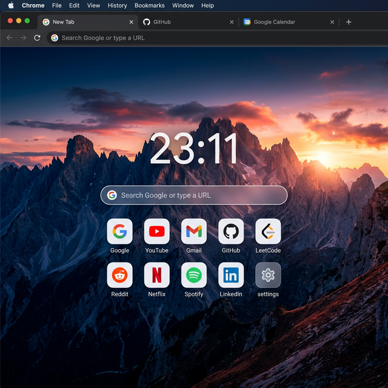

# 🚀 My Custom New Tab Chrome Extension

A beautiful, minimalist, and highly functional "New Tab" replacement for Google Chrome. Designed with a clean aesthetic and quick access to your most-used tools.



## ✨ Features

- 🕒 **Real-time Clock:** Bold digital clock to keep you on schedule.
- 🔍 **Integrated Search:** Instant access to Google Search directly from the center of your page.
- 🔗 **Smart Shortcuts:** Curated grid of productivity and coding platforms (GitHub, LeetCode, ChatGPT, Gemini, and more).
- 🌌 **Premium Aesthetics:**
    - High-quality Nature backgrounds.
    - Glassmorphism UI (Blur effects).
    - Modern Typography (Google Sans).
- ⚡ **Lightweight:** No tracking, no bloated dependencies, just pure performance.

## 🛠️ Tech Stack

- **HTML5** & **CSS3** (Glassmorphism, Flexbox, Grid)
- **Vanilla JavaScript** (ES6+)
- **Chrome Extension API** (Manifest V3)

## 🚀 Installation Guide

1. **Clone or Download** this repository to your local machine:
   ```bash
   git clone https://github.com/JabadeSusheelKrishna/My-Chrome-Extension.git
   ```
2. Open **Google Chrome** and navigate to `chrome://extensions/`.
3. Toggle on **"Developer mode"** in the top right corner.
4. Click **"Load unpacked"** and select the folder where you saved the files.
5. Open a new tab and enjoy! 🌟

## 📁 Project Structure

```text
.
├── manifest.json   # Extension configuration
├── index.html      # Main layout & styling
├── script.js        # Clock & interaction logic
├── icon.png        # Extension icon
└── preview.png      # Project screenshot
```

## 🎨 Customization

Feel free to personalize your new tab:
- **Change Background:** Update the `background-image` URL in `index.html`.
- **Add Shortcuts:** Add more `<a>` tags within the `.shortcuts-grid` in `index.html`.
- **Modify Search:** Change the `<form action="...">` to your preferred search engine.

## 👤 Author

**Jabade Susheel Krishna**
- 🎓 CS Undergrad at IIIT Hyderabad
- 📧 [susheelkrishnajabade@gmail.com](mailto:susheelkrishnajabade@gmail.com)
- 🔗 [GitHub Profile](https://github.com/JabadeSusheelKrishna)

---
*Created with ❤️ for a better browsing experience.*
